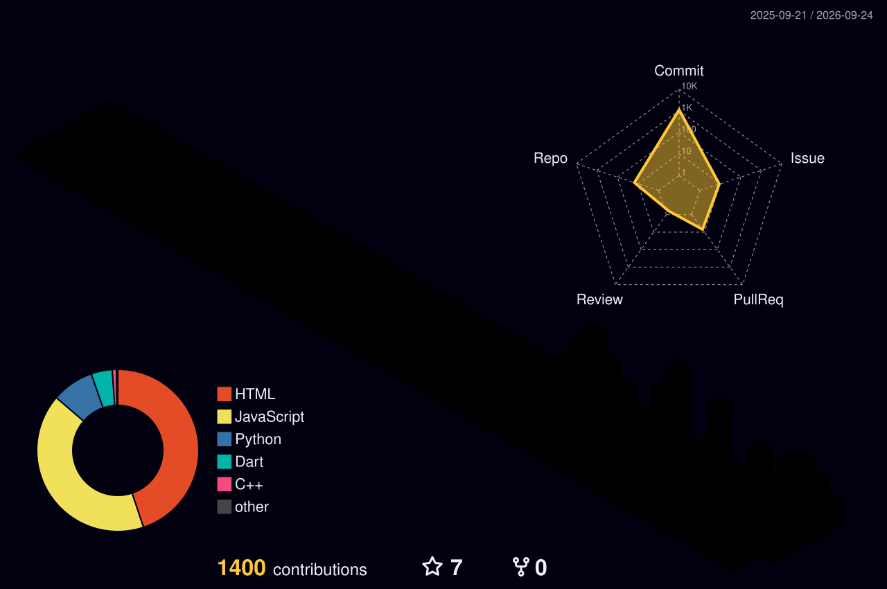

  

  用 C++ 与 Python 做桌面软件和游戏工具，把想玩的东西改成自己能控的样子。

  
  
  

## 你好，我是 VanemKrAu 👋

我关注桌面软件开发、游戏工具和自动化，喜欢把想法变成真正能跑的桌面程序：

- 🏎️ 做《王牌竞速》大招能量计算器，帮玩家算好每一次大招收益
- 🖥️ 用 **C++ / Direct3D 11 / FFmpeg** 写 Windows 桌面渲染器（Wallpaper Engine 播放器）
- 🎧 魔改 **Mineradio**，做一个更适合自己用的增强版
- 🛠️ 用 **Python** 搭数据工作台，处理游戏与桌面场景里的杂活
- 📚 边学边做，用 **HTML / JS** 做小工具和练习项目

## 精选项目

<table>
  <tr>
    <td width="50%" valign="top">
      <h3><a href="https://github.com/VanemKrAu/win-wallpaper-engine">win-wallpaper-engine</a></h3>
      
Windows 原生 Wallpaper Engine 动态壁纸渲染器，基于 Direct3D 11 + FFmpeg，把 .pkg 壁纸在桌面上跑起来。

      
<code>C++</code> <code>Direct3D 11</code> <code>FFmpeg</code>

    </td>
    <td width="50%" valign="top">
      <h3><a href="https://github.com/VanemKrAu/Ace-Racer-Calc">Ace-Racer-Calc</a></h3>
      
《王牌竞速》大招能量计算器，实时估算能量与大招时机，做游戏内决策参考。

      
<code>HTML</code> <code>JavaScript</code>

    </td>
  </tr>
  <tr>
    <td width="50%" valign="top">
      <h3><a href="https://github.com/VanemKrAu/Mineradio-Plus">Mineradio-Plus</a></h3>
      
Mineradio 个人修改增强版，在原有基础上调整功能与体验。

      
<code>JavaScript</code>

    </td>
    <td width="50%" valign="top">
      <h3><a href="https://github.com/VanemKrAu/AceRacing-Workbench">AceRacing-Workbench</a></h3>
      
王牌竞速数据工作台，用 Python 处理游戏数据与分析。

      
<code>Python</code>

    </td>
  </tr>
</table>

## 技术栈

  
  
  
  
  
  
  
  

## 📊 统计

  
  

  

## 代码之外

🎮 游戏 · 🖥️ 折腾桌面 · 🚀 把兴趣变成代码

如果你也对桌面开发、游戏工具或 C++ 渲染感兴趣，欢迎来项目里交流。
